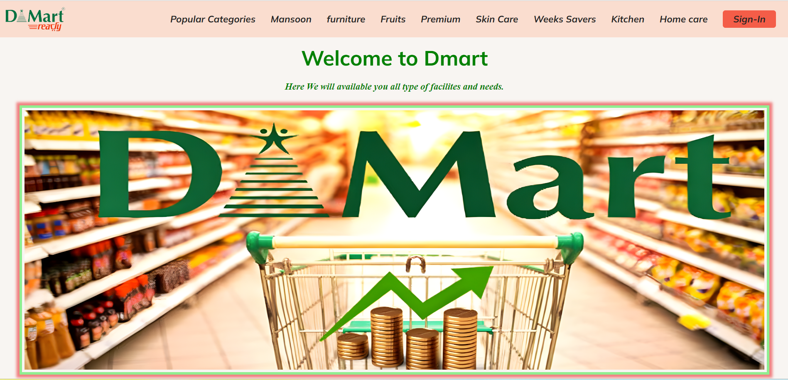

# Welcome to Dmart

Welcome to the Dmart website project! This is a basic yet comprehensive website developed by the G-12 team from RTC. The primary goal of this project is to create a well-structured webpage that provides extensive information and showcases a variety of products.

## Project Overview

This project is built using HTML and CSS, offering a visually appealing and user-friendly interface. It is designed to provide an enjoyable browsing experience with a focus on creativity and effective navigation across different sections of the website.

## Homepage

## Features

- **Responsive Design:** The website is designed to work seamlessly across different devices, providing a consistent experience on both desktop and mobile.
- **Multi-page Navigation:** Users can easily navigate through various pages, each with a distinct purpose and content.
- **Rich Content:** The website includes detailed sections for various categories of products, making it easy for users to find what they need.

## Pages Included

- **Premium Picks:** A curated selection of the best products.
- **Popular Categories:** Explore the most popular categories among shoppers.
- **Fruits & Vegetables:** Fresh produce available at great prices.
- **Furniture:** A range of furniture for every room in your home.
- **Kitchen:** Essential items for every kitchen.
- **Homecare:** Products to keep your home clean and organized.
- **Login:** Access your account for personalized shopping.
- **Week Saver:** Special deals and offers available this week.
- **Monsoon:** Seasonal products perfect for the monsoon season.

## How It Works

The website is designed with a clean layout and intuitive navigation. Each section is crafted with attention to detail, ensuring that users can easily find information and navigate between pages. The footer includes important links and contact information, providing a complete user experience.

## Visit the Website

Explore the website and discover our wide range of products: [Dmart Website](https://icp-g-12-project2.netlify.app)

Thank you for visiting!
